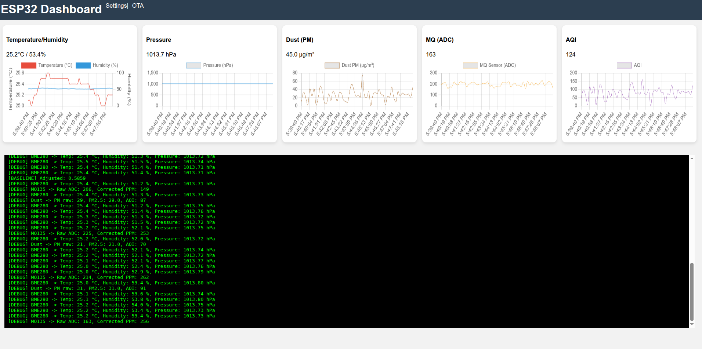
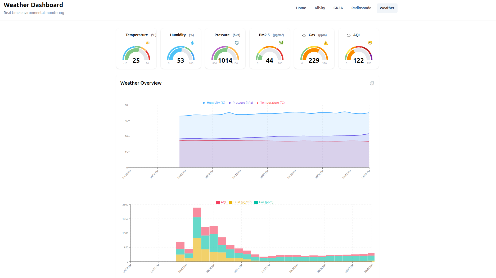

# ☁️ ESP32 Weather and Air Quality Station (weather-esp32)

This project implements a comprehensive **Weather and Air Quality Station** using the **ESP32** microcontroller. It is designed to read environmental data from multiple sensors, synchronize time via Network Time Protocol (NTP), and publish the results to an **MQTT Broker** while providing a **Web-based Dashboard and Configuration Portal**.

---

## ✨ Features

* **Multi-Sensor Data Collection:** Reads **Temperature, Humidity, Pressure** (BME280), **Dust/PM concentration** (GP2Y10), and **Gas/Air Quality** (MQ-135 or similar).
* **Temperature/Humidity Compensation:** Advanced gas processing uses the MQ-135 sensor to calculate a **Corrected Air Quality concentration ($\text{PPM}$)**, factoring in ambient temperature and humidity from the BME280 for better accuracy.
* **AQI Calculation:** Calculates the **Air Quality Index (AQI)** based on the $\mathbf{PM}_{2.5}$ concentration from the GP2Y10 dust sensor (using EPA's breakpoints).
* **Persistent & Flexible Configuration:** Stores all settings (WiFi, MQTT, GPIO pins, and sensor calibration) in the ESP32's **NVS (Non-Volatile Storage)**, configurable via the web interface.
* **Smart WiFi Management:** Scans for the configured SSID and connects to the **strongest node/BSSID** for improved stability, with a fallback to **Access Point (AP) mode** if connection fails.
* **MQTT Integration:** Publishes detailed JSON data payloads to a configurable MQTT Topic at a set interval, designed to integrate seamlessly with platforms like Home Assistant or Node-RED.
* **Live Web Dashboard:** Provides a responsive, real-time web interface using **WebSockets** for live data visualization and a streaming log output.

---

## 🛠️ Components & Requirements

| Component | Description | Integration |
| :--- | :--- | :--- |
| **Microcontroller** | ESP32 (Any variant) | WiFi, NVS, I2C, ADC |
| **BME280** | Temperature, Humidity, Pressure Sensor | I2C |
| **GP2Y10** | Analog Dust Sensor (PM approximation) | **Configurable** Analog Input, **Configurable** GPIO (for LED control) |
| **MQ-135** (or similar) | Gas/Air Quality Sensor (TVOC/CO2 equivalent) | **Configurable** Analog Input (ADC) |
| **Software** | AsyncWebServer, PubSubClient, Adafruit BME280, GP2YDustSensor, ArduinoJson (Libraries) | Required Libraries |

---

## ⚙️ Setup and Configuration

The device is designed for easy initial setup via its built-in Web Server.

1.  **Initial Power-Up:** The ESP32 attempts to connect using saved credentials. If no valid configuration is found, or if connection fails, it starts in **Access Point (AP) Mode**.
2.  **Connect to AP:** Connect your phone or PC to the WiFi network named **`ESP32-Weather-AP`** (Password: `12345678`).
3.  **Access Settings:** Navigate to `http://192.168.4.1/settings` in your browser.
4.  **Configure:** Enter your network credentials, MQTT server details, data `sendInterval`, **and the calibration parameters for the MQ-135 ($\mathbf{R_L}$, $\text{Rs/R}_0$ Baseline, TVOC Curve)**.
5.  **Save & Reboot:** Click "Save & Reboot" to store the configuration in NVS and restart the device.

---

## 📝 Data Structures

### `AppConfig_t` (Non-Volatile Storage Configuration)

This structure defines all configuration parameters saved persistently in the ESP32's NVS memory, using the provided defaults.

| Field Name | Type | Default Value | Description |
| :--- | :--- | :--- | :--- |
| `wifiSSID` | `char[32]` | `"HH"` | Target WiFi SSID. |
| `wifiPass` | `char[64]` | `"12345678"` | Target WiFi Password. |
| `mqttServer` | `char[64]` | `"pi.hoan.uk"` | MQTT Broker Hostname or IP. |
| `mqttPort` | `uint16_t` | `1883` | MQTT Broker Port. |
| `mqttUser` | `char[32]` | `"sensor"` | MQTT Username. |
| `mqttPass` | `char[64]` | `"pass1234"` | MQTT Password. |
| `mqttTopic` | `char[64]` | `"weather/data"` | MQTT Publish Topic. |
| `sendInterval` | `uint32_t` | `5000` | Data publishing frequency (milliseconds). |
| `ntpServer` | `char[64]` | `"pool.ntp.org"` | Network Time Server. |
| `dustLEDPin` | `uint8_t` | `15` | GPIO for GP2Y10 LED control. |
| `dustADCPin` | `uint8_t` | `35` | ADC pin for GP2Y10 sensor. |
| `mqADCPin` | `uint8_t` | `34` | ADC pin for MQ-135 sensor. |
| `mq_rl_kohm` | `float` | `10.0` | Load resistance ($\mathbf{R_L}$) in kOhm. |
| `mq_r0_ratio_clean` | `float` | `3.6` | Rs/R0 ratio used for $\mathbf{R_0}$ calculation in clean air. |
| `tvoc_a_curve` | `float` | `116.602` | Power curve A parameter for TVOC conversion. |
| `tvoc_b_curve` | `float` | `-2.769` | Power curve B parameter for TVOC conversion. |
| `mq_rzero` | `float` | `0.0` | Stored baseline resistance ($\mathbf{R_0}$) of the MQ-135. |
| `deviceId` | `char[8]` | `"01"` | Unique device ID. |
| `latitude` | `float` | `21.5` | Device latitude. |
| `longitude` | `float` | `105.8` | Device longitude. |

### Data Payload Format (MQTT/WebSocket)

Data is published as a JSON string containing the measured and calculated values.

```json
{
  "id": "01",              // Device ID (from config)
  "t": 28.5,               // Temperature (°C) - Rounded to 1 decimal
  "h": 65.2,               // Humidity (%) - Rounded to 1 decimal
  "p": 1012.3,             // Pressure (hPa) - Rounded to 1 decimal
  "pm": 15,                // Dust/PM raw density (approximation) - uint16_t
  "mqr": 450,              // MQ135 ADC raw value (for debugging) - int
  "mqp": 850,              // Corrected Air Quality concentration (PPM) - Rounded to 0 decimal
  "aqi": 58,               // Total AQI (from PM2.5) - int
  "ts": 1678886400123456   // Timestamp (microseconds) - uint64_t
}
```

## 📸 Screenshots

### Web Dashboard


### Device Configuration Page

