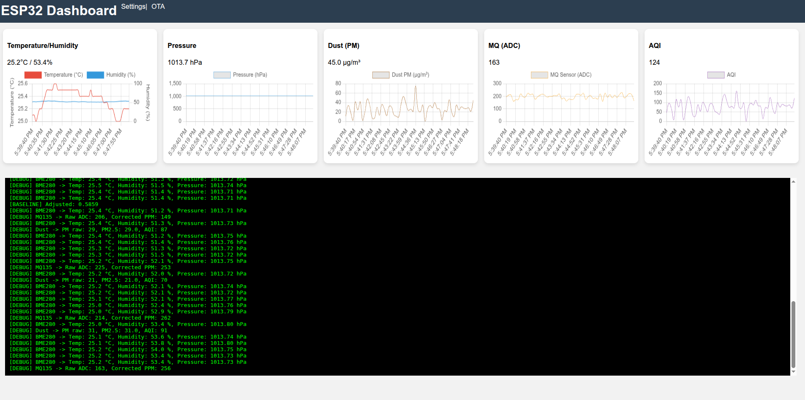
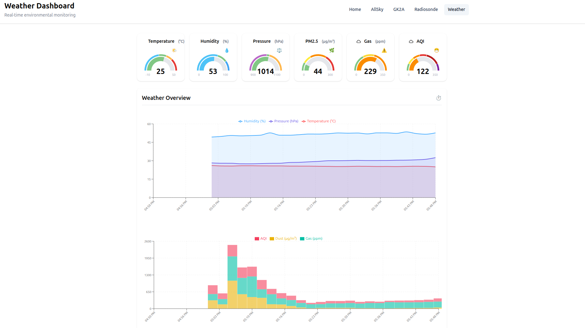

# 🌍 ESP32 Air Quality & Weather Station

This is the firmware for an ESP32-based device designed to monitor local weather conditions and air quality. It utilizes sensors for temperature, humidity, pressure, particulate matter (PM2.5/Dust), and general air quality (MQ-135), providing data locally via a web interface and remotely via MQTT.

## ✨ Key Features

* **Multi-Sensor Integration:** Reads data from:
    * **BME280:** Temperature, Humidity, and Barometric Pressure.
    * **GP2Y Dust Sensor:** Measures Particulate Matter (PM2.5/Dust Density).
    * **MQ-135:** General Air Quality Index (CO, Alcohol, Benzene, Smoke, etc.).
* **Data Transmission:**
    * **MQTT:** Publishes sensor data to a configurable MQTT broker at set intervals.
    * **WebSocket:** Real-time data updates to connected web clients for local monitoring.
* **Configuration & Monitoring:**
    * **Async Web Server:** Provides a local interface for status viewing and configuration.
    * **Configuration Persistence:** Stores settings (WiFi credentials, MQTT server, calibration data) in ESP32's Non-Volatile Storage (NVS).
* **Networking:**
    * **Robust WiFi Management:** Implements scanning and connection logic to connect to the strongest access point (based on BSSID/RSSI).
    * **Fallback Access Point (AP) Mode:** Starts a local AP if the configured WiFi connection fails.
    * **Over-The-Air (OTA) Updates:** Allows firmware updates without physical connection.
* **Calibration:**
    * Includes logic for initial and ongoing calibration of the MQ-135 and Dust sensor for better accuracy.

## 🛠️ Components & Dependencies

### Hardware
* **ESP32 Development Board** (e.g., ESP32-DevKitC)
* **BME280** (Temperature, Humidity, Pressure sensor, typically I2C)
* **GP2Y Dust Sensor** (Particulate Matter sensor, typically Analog/Digital with a control pin)
* **MQ-135** (Air Quality/Gas sensor)

### Software & Libraries

The project relies on standard and common ESP32 libraries:
* `Arduino.h`, `WiFi.h`
* `PubSubClient` (for MQTT)
* `ESPAsyncWebServer`, `AsyncTCP` (for Web Server and WebSocket)
* `ArduinoOTA` (for Over-The-Air updates)
* `Adafruit_BME280`
* `ArduinoJson` (for serializing and deserializing data/config)
* `Preferences` (for NVS configuration storage)
* `GP2YDustSensor`
* `mq135.h` (Custom or third-party library for MQ-135 handling)

## 🔌 Wiring Guide

This guide assumes the use of an ESP32 board and common sensor modules. **Always verify the specific GPIO pins defined in your `config.h` file.**

| Sensor / Module | Connection Pin | Default GPIO in `config.h` | Notes |
| :--- | :--- | :--- | :--- |
| **BME280** (I2C) | SDA | GPIO 21 | Standard I2C pins for ESP32. |
| | SCL | GPIO 22 | |
| **MQ-135** | Analog Output (A0) | GPIO 34 (`mqADCPin`) | Connects to an ADC pin on the ESP32. |
| **GP2Y Dust Sensor** | V-LED (Control) | GPIO 15 (`dustLEDPin`) | Digital pin for controlling the IR LED. |
| | V-OUT (Output) | GPIO 35 (`dustADCPin`) | Analog pin for reading voltage proportional to dust density. |
| **Power & Ground** | VCC (5V or 3.3V) | - | Depends on the sensor module's required voltage. |
| | GND | - | Connect all grounds together. |


## 🌐 Data Transmission Protocol (MQTT)

The device utilizes **MQTT (Message Queuing Telemetry Transport)** to send sensor readings to a central server or broker.

### 1. Topic Structure

The device publishes data to a single, configurable topic. The default topic structure can be customized via the Web UI or in `config.h`.

* **Configurable Topic:** `appConfig.mqttTopic`
    * *Example (based on default settings):* `esp32/weather/data`

### 2. Payload Format (JSON)

Data is transmitted as a compressed JSON object to minimize payload size and bandwidth usage. This payload is generated by the `getDataJson()` function in `data_sensor.cpp`.

| Key | Type | Description | Unit / Notes |
| :--- | :--- | :--- | :--- |
| `id` | `uint32` | Unique device identifier (`appConfig.deviceId`). | |
| `t` | `float` | Temperature. | Celsius (°C) |
| `h` | `float` | Relative Humidity. | Percent (%) |
| `p` | `float` | Barometric Pressure. | hPa (Hectopascals) |
| `pm` | `uint16` | PM2.5 / Dust Density. | $\mu g/m^3$ |
| `aqi` | `int` | Calculated Air Quality Index for PM2.5. | US EPA standard. |
| `mq` | `float` | Corrected MQ-135 Index value (Ratio Rs/R0). | Unitless Index (higher = worse quality). |
| `ts` | `uint64` | Timestamp of data acquisition. | Microseconds since epoch. |

#### Example JSON Payload:

```json
{
  "id": 12345678,
  "t": 28.5,
  "h": 65.2,
  "p": 1012.3,
  "pm": 25,
  "aqi": 78,
  "mq": 125,
  "ts": 1672531200000000
}
```

## 📸 Screenshots

### Web Dashboard


### Device Configuration Page

